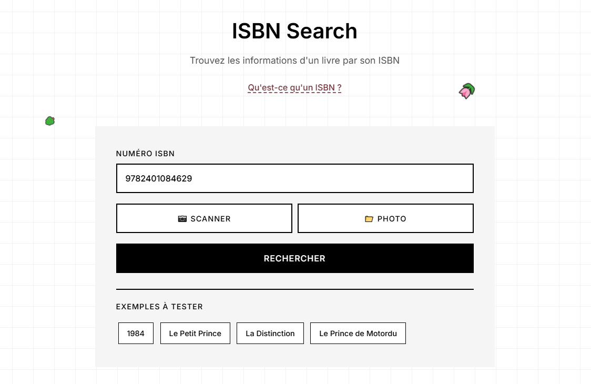

# 📚 ISBN Search



Une application moderne de recherche de livres par ISBN avec interface intuitive, scanner intégré et base de données locale.

## ✨ Fonctionnalités

- 🔍 **Recherche par ISBN** - Trouvez n'importe quel livre par son numéro ISBN
- 📱 **Scanner intégré** - Scannez les ISBN avec votre caméra
- 📷 **Upload d'images** - Analysez les ISBN depuis vos photos
- 💾 **Base de données locale** - Stockage des livres recherchés
- ✏️ **Édition collaborative** - Enrichissez les informations manquantes
- 🎨 **Interface moderne** - Design responsive et animations fluides
- 🌍 **API REST** - Backend optionnel pour partage de données

## 🚀 Installation

### Version Frontend uniquement (localStorage)

1.  **Cloner le repository**
    ```bash
    git clone https://github.com/votre-username/isbn-search.git
    cd isbn-search
    ```

2.  **Ouvrir dans un navigateur**
    Ouvrez simplement le fichier `public/index.html` dans votre navigateur ou utilisez un serveur local pour servir le dossier `public`.

### Version complète avec backend

1.  **Installer les dépendances**
    ```bash
    npm install
    ```

2.  **Démarrer le serveur de développement**
    ```bash
    node server.js
    ```
    ou pour le développement avec redémarrage automatique si `nodemon` est installé :
    ```bash
    nodemon server.js
    ```

3.  **Accéder à l'application**
    `http://localhost:3000`

## 📁 Structure du projet

```
isbn-search/
├── public/                    # Frontend statique
│   ├── index.html            # Page principale
│   ├── styles.css            # Styles CSS
│   └── js/                   # Scripts JavaScript
│       ├── app.js            # Application principale
│       ├── database.js       # Gestion base de données
│       ├── api.js            # Services API
│       ├── ui.js             # Interface utilisateur
│       └── scanner.js        # Scanner ISBN
├── data/                      # Base de données
│   └── books.json           # Fichier JSON des livres
├── server.js                # Serveur backend
├── package.json             # Configuration Node.js
└── README.md                # Documentation
```

## 🛠️ Technologies utilisées

### Frontend
- **HTML5** - Structure sémantique
- **CSS3** - Styles modernes avec animations
- **JavaScript ES6+** - Logique applicative
- **Tesseract.js** - Reconnaissance optique de caractères
- **WebRTC** - Accès caméra pour le scanner

### Backend (optionnel)
- **Node.js** - Runtime JavaScript
- **Express.js** - Framework web
- **JSON** - Base de données simple

## 📖 Utilisation

### Recherche basique
1. Entrez un ISBN dans le champ de recherche
2. Cliquez sur "Rechercher" ou appuyez sur Entrée
3. Consultez les informations du livre

### Scanner
1. Cliquez sur "📷 Scanner"
2. Autorisez l'accès à la caméra
3. Positionnez l'ISBN devant la caméra
4. Cliquez sur "Capturer" pour analyser

### Upload de photo
1. Cliquez sur "📁 Photo"
2. Sélectionnez une image contenant un ISBN
3. L'application analysera automatiquement l'image

### Édition des informations
1. Cliquez sur les boutons "Ajouter" ou "Modifier"
2. Renseignez les informations manquantes
3. Sauvegardez pour enrichir la base de données

## 📡 API REST (backend)

### Endpoints disponibles

#### Livres
```
GET    /api/books           # Rechercher des livres
GET    /api/books/:isbn     # Obtenir un livre par ISBN
POST   /api/books           # Créer un nouveau livre
PUT    /api/books/:isbn     # Mettre à jour un livre
DELETE /api/books/:isbn     # Supprimer un livre
```

### Exemples d'utilisation

**Rechercher un livre**
```bash
curl "http://localhost:3000/api/books/9782401084629"
```

**Créer un livre**
```bash
curl -X POST "http://localhost:3000/api/books" \
  -H "Content-Type: application/json" \
  -d '{
    "isbn": "9782401084629",
    "title": "1984",
    "authors": ["George Orwell"],
    "publisher": "Hachette"
  }'
```

## 🔍 Exemples d'ISBN à tester

- **9782401084629** - 1984 (George Orwell)
- **9780156013987** - Le Petit Prince (Antoine de Saint-Exupéry)
- **9782707302755** - La Distinction (Pierre Bourdieu)
- **9782075155137** - Le Prince de Motordu (Pef)

## 🤝 Contribution

1.  **Fork** le repository
2.  **Créer** une branche pour votre fonctionnalité
    ```bash
    git checkout -b feature/nouvelle-fonctionnalite
    ```
3.  **Commiter** vos changements
    ```bash
    git commit -m "Ajout de la nouvelle fonctionnalite"
    ```
4.  **Pousser** vers la branche
    ```bash
    git push origin feature/nouvelle-fonctionnalite
    ```
5.  **Créer** une Pull Request

## 📝 License

Ce projet est sous licence MIT. Voir le fichier [LICENSE](LICENSE) pour plus de détails.

## 🐛 Signaler un bug

Si vous trouvez un bug, merci de :
1. Vérifier qu'il n'a pas déjà été signalé
2. Créer une issue avec :
   - Description détaillée du problème
   - Étapes pour reproduire
   - Navigateur et version utilisés
   - Captures d'écran si pertinentes

## 📞 Support

- **Issues GitHub** : [Créer une issue](https://github.com/votre-username/isbn-search/issues)
- **Discussions** : [GitHub Discussions](https://github.com/votre-username/isbn-search/discussions)
- **Email** : votre.email@example.com

## 🙏 Remerciements

- **Google Books API** - Pour les données de livres
- **Tesseract.js** - Pour la reconnaissance optique
- **OpenLibrary** - Pour les données complémentaires
- **Contributors** - Merci à tous les contributeurs

---

⭐ **N'hésitez pas à star le repository si ce projet vous plaît !** 